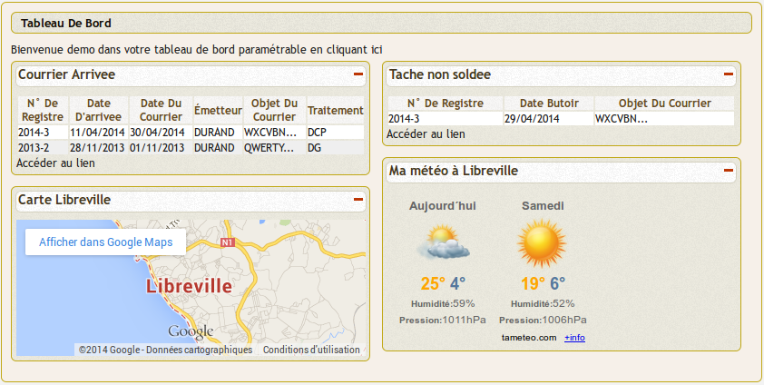

.. _widget:

###########
Les widgets
###########

openCourrier permet de construire une application composite en integrant 
des widgets dans le tableau de bord.

Le mode de fonctionnement des widget est décrit dans le guide du développeur openMairie.

Il est decrit ensuite l'integration au travers de tableau de bord personnalisés.

Il est donc possible de créer tout type de widget et de les intégrer dans un tableau
de bord personnalisé :

Dans notre cas ci dessus, l'utilisateur "demo"  a accès :

- à des applications externes ::

    la météo à Arles
    l'horoscope du jour
    les actualités via google
    
- à des applications internes ::

   courriers non soldés
    
- à des applications composites ::

    finances, ressources humaines

    
