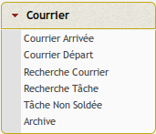
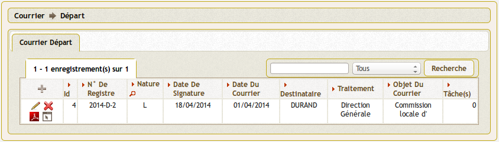
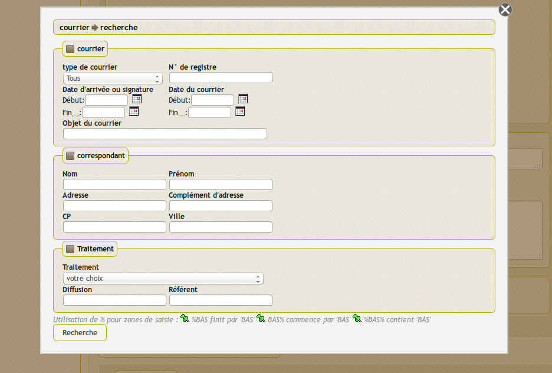
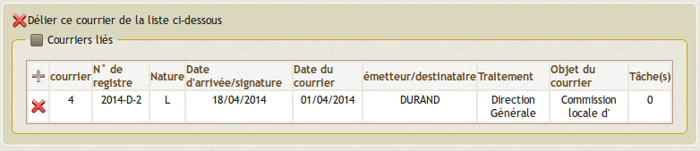
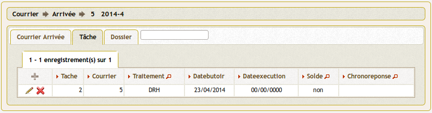
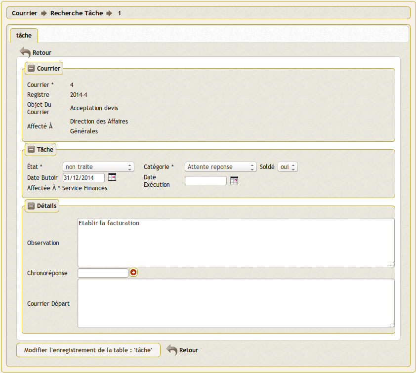
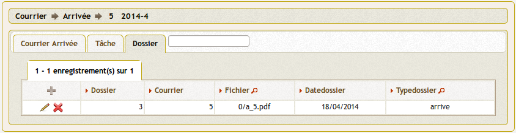
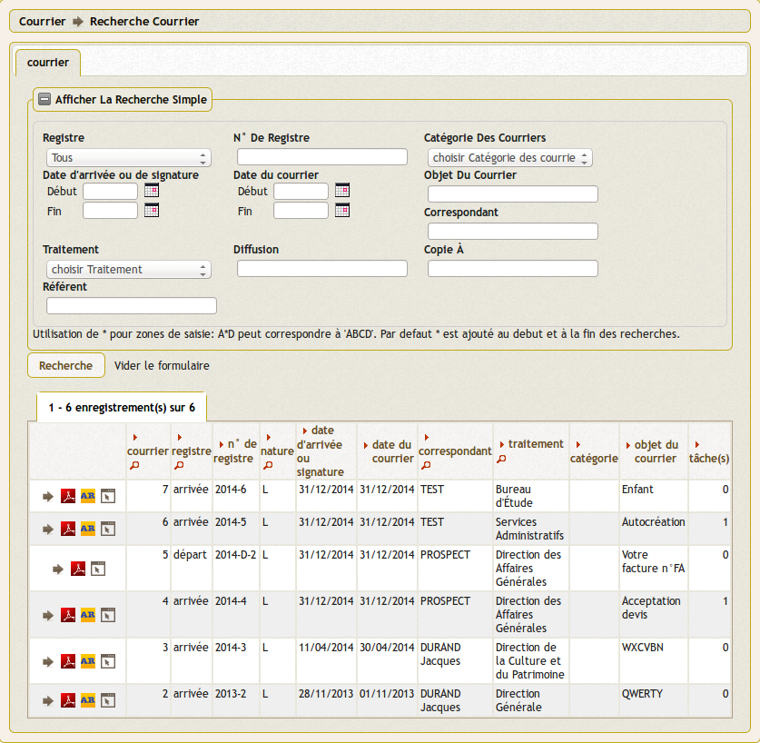

.. _gestion_des_courriers:

#####################
Gestion des courriers
#####################

Ce chapitre vous propose d'utiliser la gestion de courrier.

.. contents::

Les éléments permettant la gestion du courrier sont disponibles dans la rubrique 
(:menuselection:`Courrier`) du menu.

.. _courrier:

******************
Saisir un courrier
******************

Les courriers sont saisis soit en "courrier arrivée" soit en "courrier départ".

Courrier arrivée
----------------

(:menuselection:`Courrier --> Courrier arrivée`)

Ce sont les courriers entrants dans l'organisation.

Dans ce listing les actions possibles depuis le tableau sont : 

* Accéder au tableau de bord du courrier
* Télécharger l'édition PDF "Récapitulatif du courrier"
* Télécharger l'édition PDF "Accusé de réception" (ce courrier est paramétrable
  via le menu (:menuselection:`Administration --> Etat`)

Il est possible de créer ou modifier un courrier arrivée dans le formulaire 
ci dessous.

Il est saisi dans courrier arrivée :
 
- le premier courrier scanné du répertoire utilisateur (si un SCAN existe) à 
  associer s'affiche 

- la nature : lettre mail ... (:ref:`paramétrable par l'administrateur technique <parametre_dyn_var_inc>`)

- la date arrivée (date du jour par défaut) et date du courrier [obligatoire]
  (Vous pouver utilisez le calendrier pour  la date   ou tapez  10122001 )       

- l'émetteur : nom, prénom, adresse, CP, Ville, type de correspondant. Il est 
  possible de chercher un émetteur actif dans la table émetteur en appuyant 
  sur la flèche et de sauvegarder un émetteur en cochant la case (en ajout 
  seulement). Si un emetteur est choisi, l ensemble des données de l'emetteur
  est rapatrié dans la table courrier  

- la catégorie de courrier (si elle est paramétrée dans om_parametre)

- l'Objet : possibilité d'utiliser des textes paramétrés en appuyant sur le lien « bible »

- le Type de dossier : par défaut signalé (:ref:`paramétrable par le profil UTILISATEUR <categorie_courrier>`)

- le traitement : service chargé du traitement : obligatoire et eventuellement le référent

- la diffusion : service(s) ayant une copie  (facultatif)

- copie à : copie à destination des élus (facultatif)

le champ sur les pièces jointes est supprimé dans la version 3.2.0

Tableau de bord d'un courrier arrivée

.. image:: tdb_courrier_arrivee.png

Courrier départ
---------------

Cette fonctionnalité est optionnelle dans l'application, il est possible 
d'activer ou de désactiver la fonctionnalité dans le paramétrage (:ref:`paramétrage de l'option courrier départ <om_parametre_option_courrier_depart>`).

(:menuselection:`Courrier --> Courrier départ`)

Ce sont les courriers sortants de l'organisation.

Il est possible de créer ou modifier un courrier départ dans le formulaire 
ci dessous.

Il est saisi dans courrier départ :

- la nature : lettre mail ... (:ref:`paramétrable par l'administrateur technique <parametre_dyn_var_inc>`)

- la date signature (date du jour par défaut) et la date de départ 

- le destinataire : nom, prénom, adresse, CP, Ville, type de correspondant. Il 
  est possible de chercher un destinataire actif dans la table émetteur en 
  appuyant sur la flèche et de sauvegarder un émetteur en cochant la case (en 
  ajout seulement). Si un emetteur est choisi, l ensemble des données de 
  l'emetteur est rapatrié dans la table courrier  

- l'Objet : possibilité d'utiliser des textes paramétrés en appuyant sur le lien « bible »

- le Type de dossier : par défaut signalé (:ref:`paramétrable par le profil UTILISATEUR <categorie_courrier>`)

- le traitement : service chargé du traitement : obligatoire et eventuellement le référent

- la copieà : elu(s) ayant une copie  (facultatif)

Tableau de bord d'un courrier sortant

Règles : 

Il est à noter que si un courrier scanné est associé lors de l'ajout du d'un courrier,
il est rajouté un enregistrement dans la table dossier avec sur le scan en rouge, le numéro de registre et sa date d'arrivée.

Il est conseiller de rajouter un utilisateur spécifique pour le scan.

.. _liaison_courrier:

****************
Lier un courrier
****************

Il est proposé de décrire dans ce paragraphe la liaison de courrier.

La liaison des courriers se fait en 3 étapes :

1) dans le formulaire courrier_depart ou courrier_arrivee, appuyer sur le plus (ajout de courrier lié)

2) le moteur de recherche de courrier apparait, saisir votre recherche et valider

3) une liste de courrier correspondant à la recherche apparait, valider le courrier

le courrier correspondant est lié

La liaison s'établit par un numéro commun aux courriers liés qui font chacun référence aux autres...

.. _tache:

****************
Saisir une tâche
****************

Cet onglet permet de saisir les tâches associées aux courriers. 

Il est proposé de décrire dans ce paragraphe la saisie d'une tache associé à un courrier arrivée.

Il est possible de creer ou modifier une tâche dans le formulaire ci dessous

Il est saisi :

- la date butoire
- la date exécution
- le Solde : Oui si soldée, Non sinon.  (voir traitement : courrier -> taches non soldées)
- le Service de traitement de la tache (les services "fils" ou sous service)
- observations : Texte libre
- Chrono Éventuellement Texte libre ou courrier lié  (choix dans chronoreponse (fleche))

.. _dossier:

********************************
Télécharger un fichier / dossier
********************************

.. warning::

    Il est impératif de sauvegarder le répertoire trs/ où sont stockés les 
    documents. Il faut donc conserver ce répertoire en cas de changement de
    version. Il faut donner à apache les droits d'écriture sur ce répertoire.

Le dossier sert à conserver l'ensemble des documents relatifs au courrier :

- le courrier arrivé scanné (voir paragraphe saisir le courrier)

- les courriers départs (au format PDF)

- les divers rapports d'intervention

- les pièces jointes ...

Il est proposé de décrire dans ce paragraphe l'upload de document dans les dossiers
dans l'onglet "dossier" d'un courrier départ ou arrivée.

Les documents du dossier  sont listés dans l'onglet "dossier"

Il est possible de creer ou modifier un dossier dans le formulaire ci dessous

Les zones à saisir sont les suivantes :

- le fichier à associer  depuis son  poste de travail

    Le fichier est stocké dans le répertoire trs par centaine
    
    exemple : pour le courrier 1051; le fichier est stocké sous le nom 10/a_1051.pdf si courrier arrive
    et d_1051.pdf si courrier départ et éventuellement d_1051_2.pdf si un deuxième courrier départ est implémenté...  

- la date

- l'observation : champ texte

- le type : départ ou arrivé

.. _courrier_recherche:

*************************
La recherche de courriers
*************************

(:menuselection:`Courrier --> Recherche Courrier`)

La recherche des courriers est accessible pour chaque profil d'utilisateur et
permet de visualiser tous les courriers entrants et sortants de l'application.

Les critères de recherches sont sauvegardés au changement de page.

.. _tache_recherche:

**********************
La recherche de tâches
**********************

(:menuselection:`Courrier --> Recherche Tâche`)

La recherche des courriers est accessible pour chaque profil d'utilisateur et
permet de visualiser toutes les tâches de l'application.

Les critères de recherches sont sauvegardés au changement de page.

.. _taches_non_soldees:

**********************
Les tâches non soldées
**********************

(:menuselection:`Courrier --> Tâche non soldée`)

la liste des taches non soldées est accessible en  :
courrier -> tâche non soldée

Il est possible de modifier une tâche non soldée dans le formulaire ci dessous

(:ref:`tache`)

.. _courrier_archive:

************
Les archives
************

(:menuselection:`Courrier --> Archive`)

.. warning::

    L'archivage des courriers à une date précise se fait sur la date du courrier
    sans vérification des dates ou de l’exécution des taches associées

la liste des courrier archivés est accessible en  :
courrier -> Archive

Les archives ne sont pas modifiables et ne sont pas accessibles par le moteur 
de recherche.

