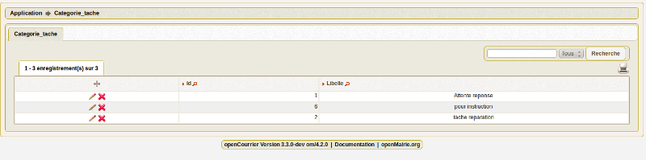
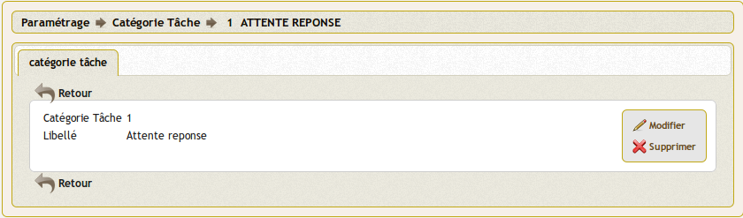

.. _categorie_tache:

##########################
Saisir une categorie tache
##########################

Il est proposé de décrire dans ce paragraphe de decrire la saisie
d'une catégorie de tache dans l'option paramétrage du menu 

Les categories sont listées dans le menu paramétrage

Il est possible de creer ou modifier une categorie dans le formulaire ci dessous

Il est saisie le libelle de la catégorie

