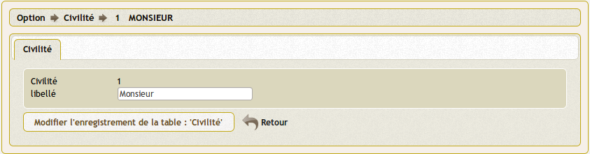

.. _civilite:

#########################
Saisir une civilité
#########################

Il est proposé de décrire dans ce paragraphe de decrire la saisie
d'une civilité dans le menu option parametrage.

Les types de dossier sont listés dans le menu "paramétrage": 

.. image:: tab_civilite.png

Il est possible de créer ou modifier une zone dans le formulaire ci dessous

Il est saisie :

- le libellé 

