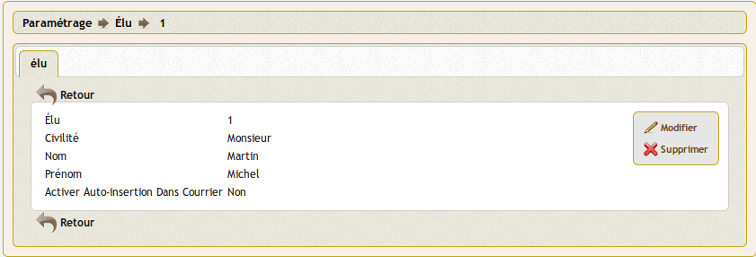

.. _elu:

#############
Saisir un élu
#############

Il est proposé de décrire dans ce paragraphe de decrire la saisie
d'un élu dans l'option paramétrage du menu 

Les élus sont listés dans l'option élu du menu paramétrage

.. image:: tab_elu.png

Il est possible de creer ou modifier un élu dans le formulaire ci dessous

Il est saisie :

- la civilité
- le nom
- le prénom
- l'insertion automatique

REGLES :

insererauto: int(1) ; valeur booléenne.
Si vraie, l’élu correspondant est automatiquement inscrit en diffusion lors de la création d’un courrier

