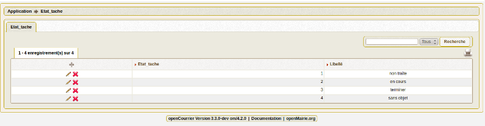
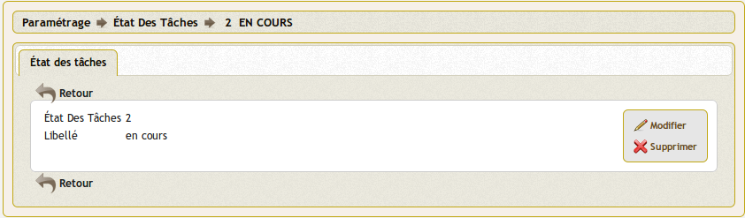

.. _etat_tache:

####################
Saisir un etat tache
####################

Il est proposé de décrire dans ce paragraphe de decrire la saisie
d'un état de tache dans l'option paramétrage du menu 

Les états sont listées dans le menu paramétrage

Il est possible de créer ou modifier un état dans le formulaire ci-dessous

Il est saisie le libelle de l'état

