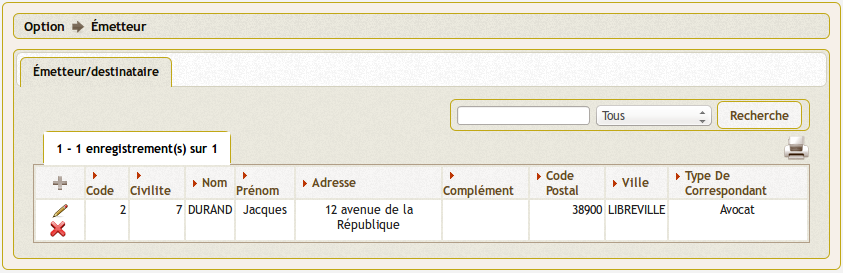
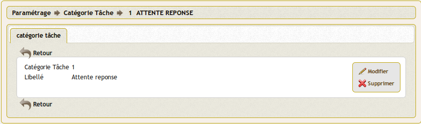
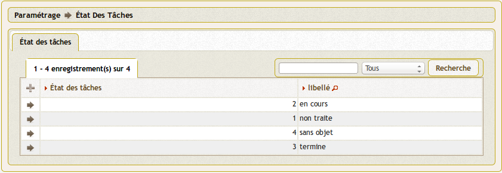

.. _parametrage:

###########
Paramétrage
###########

Le paramétrage permet d'adapter openCourrier à votre organisation.

.. contents::

********************
Tables de références
********************

Les tables de références sont disponibles dans la rubrique 
(:menuselection:`Paramétrage`) du menu.

.. image:: menu_parametrage.png

.. _service:

==========
Le service
==========

(:menuselection:`Paramétrage --> Service`)

Il est proposé de décrire dans ce paragraphe la saisie d'un service
dans le menu paramétrage.

Les services sont listés dans l'option service du menu paramétrage

.. image:: tab_service.png

Il est possible de creer ou modifier une voie dans le formulaire ci dessous

.. image:: form_service.png

Il est saisi :

- code
- libelle
- diffusion oui/non (reçoit ou non du courrier en traitement)
- service père (lien hiérarchique)

Règles :

- seul un service "père" peut attribuer des tâches à un service "fils"

paramétrage des services en om_utilisateur :

Le paramétrage "service" de l'utilisateur est spécifique à openCourrier

.. image:: form_om_utilisateur.png

cas particulier :

En affectant "tous service" dans la case service, les droits de l utilisateur s'étend à tous les services

Gestion des "scan"

Les scans d'un utilisateur sont stockés dans le repertoire trs/collectivite/utilisateur

exemple : scan/1/2 pour om_collectivite=1 et om_utilisateur=2

.. _correspondant:

==========================================
Le correspondant (émetteur / destinataire)
==========================================

(:menuselection:`Paramétrage --> Émetteur / Destinataire`)

Il s'agit ici de ne saisir que les correspondants permanents ou
fréquents (préfecture, trésorerie, ...) pour éviter de resaisir les informations
du correspondant à chaque nouvelle saisie de courrier.

L'écran suivant permet de lister les différents correspondants ainsi que les actions
possibles sur ces derniers.

Il est possible de créer ou modifier un correspondant dans le formulaire suivant.

Il est saisi :

- civilite
- nom
- prénom
- adresse
- complément
- cp
- ville
- téléphone
- type de correspondant

.. note::

    Il est possible de créer un correspondant fréquent/permanent directement 
    depuis le formulaire de création de courrier en cochant la case "création 
    émetteur" ou "création destinataire".

.. _bible:

========
La bible
========

(:menuselection:`Paramétrage --> Bible`)

La bible sert à compléter l'objet d'un courrier. Il est donc possible de stocker
des phrases réutilisables à l'identique pour chaque courrier.

Les textes bibles sont listés dans le formulaire suivant

.. image:: tab_bible.png

Il est possible de créer ou modifier bible dans le formulaire ci dessous

.. image:: form_bible.png

Il est saisi :

- un libellé affiché en fenêtre lors de la saisie du courrier

- un contenu récupéré dans objet_courrier lors de la saisie du courrier

.. _civilite:

===========
La civilité
===========

(:menuselection:`Paramétrage --> Civilité`)

La civilité correspond au titre de civilité d'une personne. Elle est utilisée
dans l'application lors de la saisie de correspondants.

L'écran suivant permet de lister les différentes civilités ainsi que les actions
possibles sur ces dernières.

.. image:: tab_civilite.png

Il est possible de créer ou modifier une civilité dans le formulaire suivant.

.. image:: form_civilite.png

Il est saisi :

- le libellé 

.. _type_correspondant:

========================
Le type de correspondant
========================

(:menuselection:`Paramétrage --> Type de correspondant`)

Le type de correspondant permet de catégoriser une personne. Il est utilisé
dans l'application lors de la saisie de correspondants.

L'écran suivant permet de lister les différents types de correspondant ainsi 
que les actions possibles sur ces derniers.

Il est possible de créer ou modifier un type de correspondant dans le 
formulaire suivant.

.. image:: form_type_correspondant.png

Il est saisi :

- le libellé du type de correspondant

.. _elu:

=====
L'élu
=====

(:menuselection:`Paramétrage --> Élu`)

Les élus peuvent être mise en copie sur les courriers.

L'écran suivant permet de lister les élus.

Il est possible de créer ou modifier un élu sur le formulaire suivant.

.. image:: form_elu.png

Il est saisi :

- la civilité
- le nom de l'élu
- le prénom de l'élu
- activer l'auto-insertion en copie sur chaque courrier, pour cela il faut
  activer l'option (voir :ref:`paramétrable par l'administrateur 
  <parametres_generaux>`)

.. _categorie_courrier:

==========================
La catégorie des courriers
==========================

(:menuselection:`Paramétrage --> Catégorie Des Courriers`)

La catégorie des courriers permet de catégoriser un courrier. Elle est utilisée
dans l'application lors de la saisie des courriers et n'est pas obligatoire.

L'écran suivant permet de lister les différentes catégories de courrier ainsi 
que les actions possibles sur ces dernières.

Il est possible de créer ou modifier une catégorie de courrier dans le 
formulaire suivant.

Il est saisi :

- le libellé de la catégorie de courrier

.. _categorie_tache:

=======================
La catégorie des tâches
=======================

(:menuselection:`Paramétrage --> Catégorie Des Tâches`)

La catégorie des tâches permet de catégoriser une tache. Elle est utilisée
dans l'application lors de la saisie des tâches.
C'est un champ obligatoire.

L'écran suivant permet de lister les différentes catégories de tâche ainsi 
que les actions possibles sur ces dernières.

.. image:: tab_categorie_tache.png

Il est possible de créer ou modifier une catégorie de tâche dans le 
formulaire suivant.

Il est saisi :

- le libellé de la catégorie de tâche

.. _etat_tache:

=================
L'état des tâches
=================

(:menuselection:`Paramétrage --> État Des Tâches`)

L'état des tâches permet d'indiquer l'avancement d'une tache. Il est utilisé
dans l'application lors de la saisie des tâches.
C'est un champ obligatoire.

L'écran suivant permet de lister les différents états de tâche ainsi 
que les actions possibles sur ces derniers.

Il est possible de créer ou modifier un état de tâche dans le 
formulaire suivant.

.. image:: form_etat_tache.png

Il est saisi :

- le libellé de l'état de tâche

.. _parametres_generaux:

*******************
Paramètres généraux
*******************

Ce paramétrage permet de configurer certaines options spécifiques de 
l'application. Il est accessible via le menu 
(:menuselection:`Administration --> Paramètre`).

Voici le descriptif de ces paramètres :

.. list-table:: 
   :widths: 20 80
   :header-rows: 1
  
   * - Paramètre
     - Description

   * - .. _om_parametre_maire:

       "maire"
     - Nom du maire.

   * - .. _om_parametre_ville:

       "ville"
     - Nom de la ville.

   * - .. _om_parametre_registre_arrivee:
       
       "registre_arrivee"
     - Par défaut : "[annee]-[seq]".
       Caractéristique du registre dans notre cas 2012-0001.

   * - .. _om_parametre_registre_depart:
       
       "registre_depart"
     - Par défaut : "[annee]-D-[seq]".
       Caractéristique du registre dans notre cas 2012-D-0001.

   * - .. _om_parametre_option_courrier_depart:

       "option_courrier_depart"
     - Par défaut : "true".
       Utilisation du courrier départ.

   * - .. _om_parametre_service_tache:

       "service_tache"
     - Par défaut : "1".
       Indique si les tâches peuvent être affectées uniquement aux services 
       enfants du service qui traite le courrier (1) ou à tous les services 
       de la commune (0).

   * - .. _om_parametre_option_elu:

       "option_elu"
     - Par défaut : "false".
       Affiche la gestion des élus sur les courriers (identique aux services).

   * - .. _om_parametre_autoinsertion_diffusion:

       "autoinsertion_diffusion"
     - Par défaut : "false".
       Ajoute une case à cocher sur les services et les élus pour qu'ils
       soient automatiquement en diffusion lors de l'ajout d'un courrier.

   * - .. _om_parametre_autocreation_tache:

       "autocreation_tache"
     - Par défaut : "true".
       Création automatique d'une tâche de réponse lors de la création d'un
       courrier.

   * - .. _om_parametre_delai_reponse:

       "delai_reponse"
     - Par défaut : "15".
       Délai de réponse à un courrier. Permet de saisir la date butoir d'une
       tâche créée automatiquement.

   * - .. _om_parametre_vue_sous_service:

       "vue_sous_service"
     - Par défaut : "false".
       Possibilité au service de voir les éléments de ses sous services.

   * - .. _om_parametre_voption_localisation:

       "voption_localisation"
     - Par défaut : "false".
       Active la géolocalisation des tâches.

   * - .. _om_parametre_filtre_recherche_service:
    
       "filtre_recherche_service"
     - Par défaut : "false".
       Active le filtre par service. Les résultats des listings sont filtrés par le service de l'utilisateur.

.. _parametre_dyn_var_inc:

****************************************************
Paramètres spécifiques dans le fichier `dyn/var.inc`
****************************************************

Ce paramétrage est réservé à l'administrateur technique de l'application.
Il permet de configurer des options critiques ou des listes de références
non destinées à être modifiées régulièrement. Il est accessible via le 
système de fichiers directement sur le serveur. Il n'est pas possible de 
modifier ce paramétrage via l'interface de l'application.

paramètres de `dyn/var.inc`

.. code-block:: php

   <?php
   ...

   // nature dans objet courrier    
   $select_nature = array('','CH','F','L','LAR','MAIL','TEL','TLE');
   $select_naturelib = array(
       'Votre choix',
       'Chronopost',
       'Fax',
       'Lettre',
       'Lettre A/R',
       'Email',
       'T&eacute;l&eacute;copie',
       'T&eacute;l&eacute;gramme',
   );

   // type dans objet courrier
   $select_type = array('', 's');
   $select_typelib = array('Votre Choix', 'signale');

   ...
   ?>

.. _parametre_dyn_config_inc_php:

***********************************************************
Paramètres spécifiques dans le fichier `dyn/config.inc.php`
***********************************************************

Ce paramétrage est réservé à l'administrateur technique de l'application.
Il permet de configurer des options critiques ou des listes de références
non destinées à être modifiées régulièrement. Il est accessible via le 
système de fichiers directement sur le serveur. Il n'est pas possible de 
modifier ce paramétrage via l'interface de l'application.

paramètres de `dyn/config.inc.php`

.. code-block:: php

   <?php
   ...

   /**
    * Configuration de la notification par mail des nouvelles taches attribuees aux utilisateurs du service concerne
    * Default : false
    */
   $config['notification_email'] = false;
  
   /**
    * Mail de notification
    */
   $config['notification_email_title']=utf8_decode("OpenCourrier [ville] : une nouvelle tâche vous a été affectée");
   $config['notification_email_corps']=utf8_decode("Bonjour,
     
   Une nouvelle tâche vous a été affectée sur l'application openCourrier. 
   Vous pouvez la consulter en suivant le lien présenté ci-dessous :
     
   <a href='http://demo.openmairie.org/opencourrier/scr/form.php?obj=tache&idx=[id_task]'>
   Lien vers la tache.</a>
     
   Cordialement, 
   L'administrateur de openCourrier, [ville].");

   /**
    * Configuration du nombre de colonnes sur le tableau de bord.
    */
   $config['dashboard_nb_column'] = 2;

   /**
    * Option pour la gestion du scan automatique
    * Cette option permet d'activer lors de l'ajout d'un courrier la récupération 
    * dans le répertoire ../scan/<ID_COLLECTIVTE>/<ID_UTILISATEUR>/ d'un fichier
    * PDF qui aurait été préalablement scanné et déposé dans ce répertoire. 
    * Lors de l'enregistrement du courrier ce fichier est rattaché au courrier
    * via l'onglet dossier et le numéro de registre est inscrit en rouge directement
    * dans le PDF. Ce fichier est alors supprimé.
    * Valeurs disponibles : 
    *  - true => Option activée
    *  - false => Option désactivée
    * Default : $config['option_scanpdf'] = true;
    */
   $config['option_scanpdf'] = true;
   
   ...
   ?>

.. _parametre_dyn_mail_inc_php:

*********************************************************
Paramètres spécifiques dans le fichier `dyn/mail.inc.php`
*********************************************************

Ce paramétrage est réservé à l'administrateur technique de l'application.
Il permet de configurer des options critiques ou des listes de références
non destinées à être modifiées régulièrement. Il est accessible via le 
système de fichiers directement sur le serveur. Il n'est pas possible de 
modifier ce paramétrage via l'interface de l'application.

paramètres de `dyn/config.inc.php`

.. code-block:: php

   <?php
   ...

   /**
    *
    */
   $mail = array();
   
   /**
    * Informations sur $mail
    *
    *  La variable $mail est un tableau associatif. Ce tableau peut, de ce
    *  fait, contenir plusieurs configurations de serveur mail différentes.
    *
    *  Chaque serveur est représente par une cle de tableau. Ces cles se
    *  retrouvent dans le fichier database.inc.php et permettent d'associer
    *  une base de donnees precise a un serveur mail precis.
    *
    *  Les autres cles de configuration :
    *
    *       mail_host -> Adresse du serveur de mail
    *       mail_port -> Port d'ecoute du serveur de mail
    *       
    *       mail_username -> Identifiant de l'utilisateur du serveur de mail
    *       mail_pass     -> Mot de passe de cet utilisateur
    *
    *       mail_from      -> Adresse email de l'expediteur
    *       mail_from_name -> Nom de l'expediteur
    */
   $mail["mail-default"] = array(
       'mail_host' => '',
       'mail_port' => '',
       'mail_username' => '',
       'mail_pass' => '',
       'mail_from' => '',
       'mail_from_name' => '',
   );

   ...
   ?>
