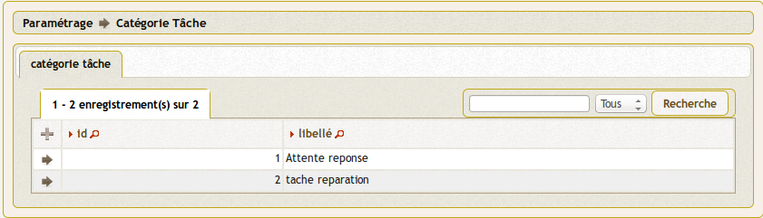
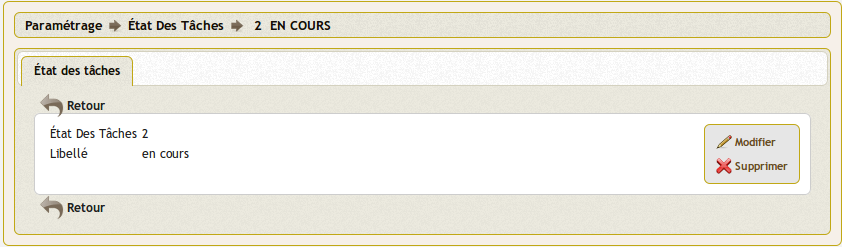

.. _parametrage:

###########
Paramétrage
###########

Nous vous proposons dans ce chapitre d'utiliser le paramétrage et d'adapter openCourrier à votre organisation.

.. contents::

********************
Tables de références
********************

Elles sont accessibles dans le menu, option paramétrage.

Il est possible de paramétrer ::

    pour le courrier arrivée
    - bible (objet du courrier)
    - catégorie_courrier
    - civilite
    - élu (copie)
    - emetteur
    - service (traitement et copie)
    - type de coorrespondant

    pour les taches
    - catégorie
    - état
    
    pour les emetteurs
    - civilite
    - type de correspondant
    
    pour les élus
    - civilite

Un exemple de paramétrage (celui de la ville de Bron) est fourni dans data/mysql/init_metier.sql

.. _service:

==========
Le service
==========

(:menuselection:`Paramétrage --> Service`)

Il est proposé de décrire dans ce paragraphe de decrire la saisie
d'un service dans l'option paramétrage du menu 

Les services sont listées dans l'option service du menu paramétrage

.. image:: tab_service.png

Il est possible de creer ou modifier une voie dans le formulaire ci dessous

.. image:: form_service.png

Il est saisie :

- code

- libelle

- diffusion oui/non (reçoit ou non du courrier en traitement)

- service père (lien hiérarchique)

- insertion automatique

Règles :

- seul un service "père" peut attribuer des tâches à un service "fils"

- pour qu'un service "père" puisse visualiser les courrier de sous service (ou service "fils") mettre vue_sous_service=true dans om_parametre

L'affichage ou non des courriers des services "fils" par un service "père" est
paramétrable dans le :ref:`paramétrage général <om_parametre_vue_sous_service>`
de l'application.

paramétrage des services en om_utilisateur :

Le paramétrage "service" de l'utilisateur est spécifique à openCourrier

.. image:: form_om_utilisateur.png

cas particulier :

En affectant "tous service" dans la case service, les droits de l utilisateur s'étend à tous les services

Gestion des "scan"

Les scans d'un utilisateur sont stockés dans le repertoire trs/collectivite/utilisateur

exemple : scan/1/2 pour om_collectivite=1 et om_utilisateur=2

.. _emetteur:

=========================
L'émetteur / destinataire
=========================

(:menuselection:`Paramétrage --> Émetteur / Destinataire`)

Il est proposé de décrire dans ce paragraphe de decrire la saisie d'un emetteur
dans le menu paramétrage.

Il s'agit dans cette option que de ne saisir que les emetteurs permanents (prefecture, trésorerie ...)

Il est affiché les emetteurs

.. image:: tab_emetteur.png

Il est possible de créer ou modifier un  emetteur dans le formulaire ci dessous

.. image:: form_emetteur.png

Il est saisie :

- civilite

- nom

- prénom

- adresse

- complément

- cp

- ville

- téléphone

- type de correspondant

- courriel 

Lors de la création d'un courrier, en cochant la case emetteur, l'emetteur est créé dans la table emetteur

.. _bible:

========
La bible
========

(:menuselection:`Paramétrage --> Bible`)

La bible sert à compléter l'objet d'un courrier

Il est proposé de décrire dans ce paragraphe de décrire la saisie de la bible dans le menu paramètrage

Les textes bibles sont listés dans le formulaire suivant

.. image:: tab_bible.png

Il est possible de créer ou modifier bible dans le formulaire ci dessous

.. image:: form_bible.png

Il est saisie :

- un libellé affiché en fenêtre lors de la saisie du courrier

- un contenu récupéré dans objet_courrier lors de la saisie du courrier

.. _civilite:

===========
La civilité
===========

(:menuselection:`Paramétrage --> Civilité`)

Il est proposé de décrire dans ce paragraphe de decrire la saisie
d'une civilité dans le menu option parametrage.

Les types de dossier sont listés dans le menu "paramétrage": 

.. image:: tab_civilite.png

Il est possible de créer ou modifier une zone dans le formulaire ci dessous

.. image:: form_civilite.png

Il est saisie :

- le libellé 

.. _type_correspondant:

========================
Le type de correspondant
========================

(:menuselection:`Paramétrage --> Type de correspondant`)

Il est proposé de décrire dans ce paragraphe la saisie des types de correspondant dans le menu paramétrage

Les types de correspondant sont listés dans le formulaire suivant

.. image:: tab_type_correspondant.png

Il est possible de créer ou modifier ou supprimer un type de correspondant
dans le formulaire ci dessous

.. image:: form_type_correspondant.png
        

Il est saisie :

- le libellé du type de correspondant

.. _elu:

=====
L'élu
=====

(:menuselection:`Paramétrage --> Élu`)

Il est proposé de décrire dans ce paragraphe de decrire la saisie
d'un élu dans l'option paramétrage du menu 

Les élus sont listés dans l'option élu du menu paramétrage

.. image:: tab_elu.png

Il est possible de creer ou modifier un élu dans le formulaire ci dessous

.. image:: form_elu.png

Il est saisie :

- la civilité
- le nom
- le prénom
- l'insertion automatique

REGLES :

insererauto: int(1) ; valeur booléenne.
Si vraie, l’élu correspondant est automatiquement inscrit en diffusion lors de la création d’un courrier

.. _categorie_courrier:

==========================
La catégorie des courriers
==========================

(:menuselection:`Paramétrage --> Catégorie des courriers`)

Il est proposé de décrire dans ce paragraphe de decrire la saisie
d'une catégorie de courrier dans l'option paramétrage du menu 

Les categories sont listées dans le menu paramétrage

.. image:: tab_categorie_courrier.png

Il est possible de créer ou modifier une categorie dans le formulaire ci-dessous

.. image:: form_categorie_courrier.png

Il est saisie :

- le libelle de la catégorie de tâche

L'affichage de la catégorie du courrier est paramétrable dans le 
:ref:`paramétrage général <om_parametre_categorie_courrier>` de l'application.

.. _categorie_tache:

=======================
La catégorie des tâches
=======================

(:menuselection:`Paramétrage --> Catégorie des tâches`)

Il est proposé de décrire dans ce paragraphe de decrire la saisie
d'une catégorie de tache dans l'option paramétrage du menu 

Les categories sont listées dans le menu paramétrage

Il est possible de creer ou modifier une categorie dans le formulaire ci dessous

.. image:: form_categorie_tache.png

Il est saisie le libelle de la catégorie

.. _etat_tache:

=================
L'état des tâches
=================

(:menuselection:`Paramétrage --> État des tâches`)

Il est proposé de décrire dans ce paragraphe de decrire la saisie
d'un état de tache dans l'option paramétrage du menu 

Les états sont listées dans le menu paramétrage

.. image:: tab_etat_tache.png

Il est possible de créer ou modifier un état dans le formulaire ci-dessous

Il est saisie le libelle de l'état

*******************
Paramètres généraux
*******************

Ce paramétrage permet de configurer certaines options spécifiques de 
l'application. Il est accessible via le menu 
(:menuselection:`Administration --> Paramètre`).

Voici le descriptif de ces paramètres :

.. list-table:: 
   :widths: 20 80
   :header-rows: 1
  
   * - paramètre
     - description

   * - .. _om_parametre_registre_arrivee:
       
       "registre_arrivee"
     - Par défaut : "[annee]-[seq]".
       Caractéristique du registre dans notre cas 2012-0001.

   * - .. _om_parametre_registre_depart:
       
       "registre_depart"
     - Par défaut : "[annee]-D-[seq]".
       Caractéristique du registre dans notre cas 2012-D-0001.

   * - .. _om_parametre_option_courrier_depart:

       "option_courrier_depart"
     - Par défaut : "true".
       Utilisation du courrier départ.

   * - .. _om_parametre_categorie_courrier:
   
       "categorie_courrier"
     - Par défaut : "true".
       Utilisation du champ categorie courrier.

   * - .. _om_parametre_vue_sous_service:

       "vue_sous_service"
     - Par défaut : "false".
       Possibilité au service de voir les sous service ("fils").

   * - .. _om_parametre_delai_reponse:

       "delai_reponse"
     - Par défaut : "15".
       Délai de réponse automatique en auto création de tache.

   * - .. _om_parametre_autocreation_tache:

       "autocreation_tache"
     - Par défaut : "true".
       Autocréation de tâche lors de la création de courrier.

****************************************************
Paramètres spécifiques dans le fichier `dyn/var.inc`
****************************************************

Ce paramétrage est réservé à l'administrateur technique de l'application.
Il permet de configurer des options critiques ou des listes de références
non destinées à être modifiées régulièrement. Il est accessible via le 
système de fichiers directement sur le serveur. Il n'est pas possible de 
modifier ce paramétrage via l'interface de l'application.

paramètres de dyn/var.inc

.. code-block:: php

   <?php
   ...

   // nature dans objet courrier    
   $select_nature = array('','CH','F','L','LAR','MAIL','TEL','TLE');
   $select_naturelib = array(
       'Votre choix',
       'Chronopost',
       'Fax',
       'Lettre',
       'Lettre A/R',
       'Email',
       'T&eacute;l&eacute;copie',
       'T&eacute;l&eacute;gramme',
   );

   // type dans objet courrier
   $select_type = array('', 's');
   $select_typelib = array('Votre Choix', 'signale');
   
   ...
   ?>             
