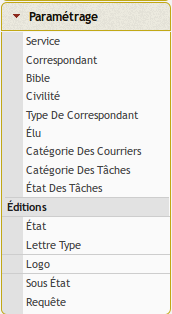
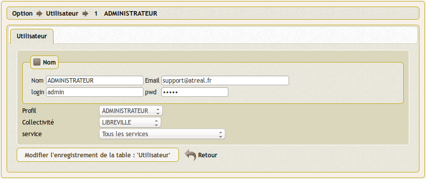
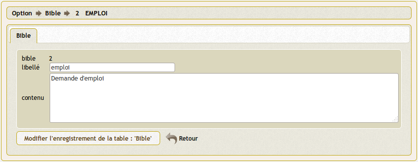
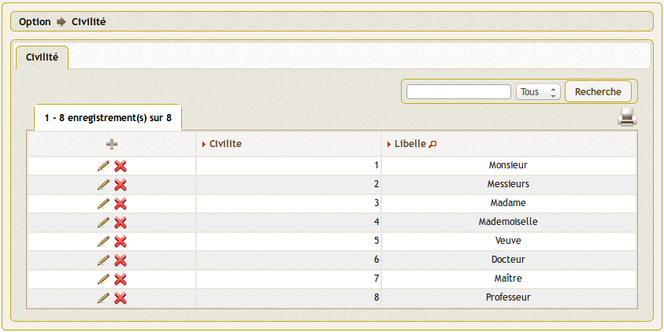
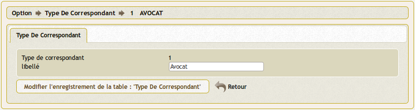

.. _parametrage:

###########
Paramétrage
###########

Le paramétrage permet d'adapter openCourrier à votre organisation.

.. contents::

********************
Tables de références
********************

Les tables de références sont disponibles dans la rubrique 
(:menuselection:`Paramétrage`) du menu.

.. _service:

==========
Le service
==========

(:menuselection:`Paramétrage --> Service`)

Il est proposé de décrire dans ce paragraphe la saisie d'un service
dans le menu paramétrage.

Les services sont listés dans l'option service du menu paramétrage

Il est possible de creer ou modifier une voie dans le formulaire ci dessous

Il est saisi :

- code
- libelle
- diffusion oui/non (reçoit ou non du courrier en traitement)
- service père (lien hiérarchique)

Règles :

- seul un service "père" peut attribuer des tâches à un service "fils"

paramétrage des services en om_utilisateur :

Le paramétrage "service" de l'utilisateur est spécifique à openCourrier

cas particulier :

En affectant "tous service" dans la case service, les droits de l utilisateur s'étend à tous les services

Gestion des "scan"

Les scans d'un utilisateur sont stockés dans le repertoire trs/collectivite/utilisateur

exemple : scan/1/2 pour om_collectivite=1 et om_utilisateur=2

.. _correspondant:

==========================================
Le correspondant (émetteur / destinataire)
==========================================

(:menuselection:`Paramétrage --> Émetteur / Destinataire`)

Il s'agit ici de ne saisir que les correspondants permanents ou
fréquents (préfecture, trésorerie, ...) pour éviter de resaisir les informations
du correspondant à chaque nouvelle saisie de courrier.

L'écran suivant permet de lister les différents correspondants ainsi que les actions
possibles sur ces derniers.

.. image:: tab_emetteur.png

Il est possible de créer ou modifier un correspondant dans le formulaire suivant.

.. image:: form_emetteur.png

Il est saisi :

- civilite
- nom
- prénom
- adresse
- complément
- cp
- ville
- téléphone
- type de correspondant

.. note::

    Il est possible de créer un correspondant fréquent/permanent directement 
    depuis le formulaire de création de courrier en cochant la case "création 
    émetteur" ou "création destinataire".

.. _bible:

========
La bible
========

(:menuselection:`Paramétrage --> Bible`)

La bible sert à compléter l'objet d'un courrier

Il est proposé de décrire dans ce paragraphe de décrire la saisie de la bible dans le menu paramètrage

Les textes bibles sont listés dans le formulaire suivant

.. image:: tab_bible.png

Il est possible de créer ou modifier bible dans le formulaire ci dessous

Il est saisi :

- un libellé affiché en fenêtre lors de la saisie du courrier

- un contenu récupéré dans objet_courrier lors de la saisie du courrier

.. _civilite:

===========
La civilité
===========

(:menuselection:`Paramétrage --> Civilité`)

La civilité correspond au titre de civilité d'une personne. Elle est utilisée
dans l'application lors de la saisie de correspondants.

L'écran suivant permet de lister les différentes civilités ainsi que les 
possibles sur ces dernières.

Il est possible de créer ou modifier une civilité dans le formulaire suivant.

.. image:: form_civilite.png

Il est saisi :

- le libellé 

.. _type_correspondant:

========================
Le type de correspondant
========================

(:menuselection:`Paramétrage --> Type de correspondant`)

Le type de correspondant permet de catégoriser une personne. Il est utilisé
dans l'application lors de la saisie de correspondants.

L'écran suivant permet de lister les différents types de correspondant ainsi 
que les possibles sur ces derniers.

.. image:: tab_type_correspondant.png

Il est possible de créer ou modifier un type de correspondant dans le 
formulaire suivant.

        
Il est saisi :

- le libellé du type de correspondant

*******************
Paramètres généraux
*******************

Ce paramétrage permet de configurer certaines options spécifiques de 
l'application. Il est accessible via le menu 
(:menuselection:`Administration --> Paramètre`).

Voici le descriptif de ces paramètres :

.. list-table:: 
   :widths: 20 80
   :header-rows: 1
  
   * - paramètre
     - description

   * - .. _om_parametre_registre_arrivee:
       
       "registre_arrivee"
     - Par défaut : "[annee]-[seq]".
       Caractéristique du registre dans notre cas 2012-0001.

   * - .. _om_parametre_registre_depart:
       
       "registre_depart"
     - Par défaut : "[annee]-D-[seq]".
       Caractéristique du registre dans notre cas 2012-D-0001.

   * - .. _om_parametre_option_courrier_depart:

       "option_courrier_depart"
     - Par défaut : "true".
       Utilisation du courrier départ.

.. _parametre_dyn_var_inc:

****************************************************
Paramètres spécifiques dans le fichier `dyn/var.inc`
****************************************************

Ce paramétrage est réservé à l'administrateur technique de l'application.
Il permet de configurer des options critiques ou des listes de références
non destinées à être modifiées régulièrement. Il est accessible via le 
système de fichiers directement sur le serveur. Il n'est pas possible de 
modifier ce paramétrage via l'interface de l'application.

paramètres de dyn/var.inc

.. code-block:: php

   <?php
   ...

   // nature dans objet courrier    
   $select_nature = array('','CH','F','L','LAR','MAIL','TEL','TLE');
   $select_naturelib = array(
       'Votre choix',
       'Chronopost',
       'Fax',
       'Lettre',
       'Lettre A/R',
       'Email',
       'T&eacute;l&eacute;copie',
       'T&eacute;l&eacute;gramme',
   );

   // type dans objet courrier
   $select_type = array('', 's');
   $select_typelib = array('Votre Choix', 'signale');
   
   ...
   ?>             

