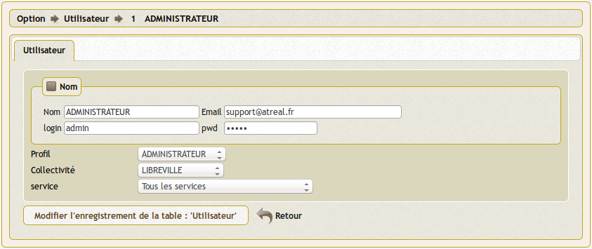

.. _principes_parametrage:

##########################
Paramètre de l'application
##########################

L'application se paramètre :

- dans le fichier dyn/var.inc (paramètres de l application) 

- dans la table om_parametre (paramètres de la collectivité)

- dans les tables de paramètrage

paramètres de dyn/var.inc ::

    // nature dans objet courrier
    
    $select_nature=array('','CH','F','L','LAR','MAIL','TEL','TLE');
    $select_naturelib=array('Votre choix',
                'Chronopost',
                'Fax',
                'Lettre',
                'Lettre A/R',
                'Email',
                'T&eacute;l&eacute;copie',
                'T&eacute;l&eacute;gramme');
    
    // type dans objet courrier
    
    $select_type=array('', 's');
    $select_typelib=array('Votre Choix', 'signale');

Paramétrage de la collectivité ::

    registre_arrivee 	    [annee]-[seq] 	   caractéristique du registre dans notre cas 2012-0001
    registre_depart 	    [annee]-D-[seq]    caractéristique du registre dans notre cas 2012-D-0001
 	option_courrier_depart  true               utilisation du courrier départ
  	categorie_courrier 	    true 	           utilisation du champ categorie courrier
 	vue_sous_service 	    false              possibilité au service de voir les sous service ("fils")
  	delai_reponse 	        15 	               délai de réponse automatique en auto création de tache
  	autocreation_tache 	    true               autocréation de tache lors de création de courrier

=====================
Tables de paramétrage
=====================

Elles sont accessibles dans le menu, option paramétrage.

Il est possible de paramétrer ::

    pour le courrier arrivée
    - bible (objet du courrier)
    - catégorie_courrier
    - civilite
    - élu (copie)
    - emetteur
    - service (traitement et copie)
    - type de coorrespondant

    pour les taches
    - catégorie
    - état
    
    pour les emetteurs
    - civilite
    - type de correspondant
    
    pour les élus
    - civilite

Un exemple de paramétrage (celui de la ville de Bron) est fourni dans data/mysql/init_metier.sql

==========================================
paramétrage des services en om_utilisateur
==========================================

Le paramétrage "service" de l'utilisateur est spécifique à openCourrier

cas particulier :

En affectant "tous service" dans la case service, les droits de l utilisateur s'étend à tous les services

Gestion des "scan"

Les scans d'un utilisateur sont stockés dans le repertoire trs/collectivite/utilisateur

exemple : scan/1/2 pour om_collectivite=1 et om_utilisateur=2