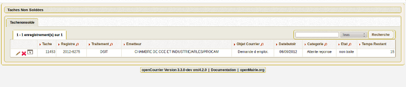

.. _recherche:

#########
Recherche
#########

Plusieurs programmes de recherche sont implémentés en attente du moteur de recherche de la version du framework 4.3.0.

.. contents::

*************************
La recherche de courriers
*************************

(:menuselection:`Courrier --> Recherche Courrier`)

La recherche des courriers est accessible en courrier -> recherche courrier

.. image:: recherche_courrier.png

**********************
Les tâches non soldées
**********************

(:menuselection:`Courrier --> Tâche non soldée`)

la liste des taches non soldées est accessible en  :
courrier -> taches non soldees

************
Les archives
************

(:menuselection:`Courrier --> Archive`)

