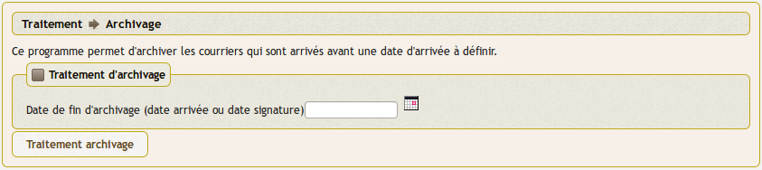

.. _archivage:

#########################
L'archivage des courriers
#########################

Ce traitement archive les courriers, dossiers et tâches à partir d'une date.

il est accessible au menu option traitement -> archivage

Ce traitement permet d'accelerer les recherches 

Les archives ne sont pas modifiables et ne sont pas accessible par le moteur de recherche.

L'accès aux archives se fait par l'option : courrier -> archives

.. image:: courrier_archive.png

