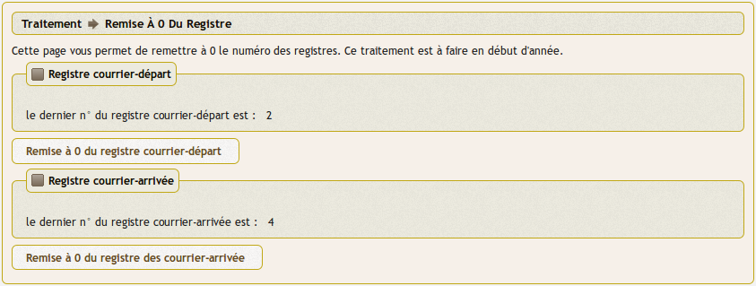
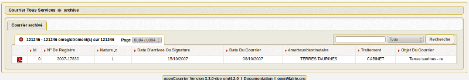

.. _traitement:

##########
Traitement
##########

Nous vous proposons dans ce chapitre de mettre en oeuvre les traitements.

.. contents::

.. _registre:

******************************
La remise à zéro des registres
******************************

Ce traitement est à faire à chaque début d'année. Il remet à zéro la séquence 
utilisée pour les registres (les identifiants des séquences sont `registre_seq`
pour les courriers arrivée et `registre_depart_seq` pour les courriers départ).

Ce traitement est accessible via le menu 
(:menuselection:`Traitement --> Registre`) :

.. _archivage:

*************************
L'archivage des courriers
*************************

Ce traitement archive les courriers, dossiers et tâches à partir d'une date. 
Il permet d'accélérer les recherches.

Ce traitement est accessible via le menu 
(:menuselection:`Traitement --> Archivage`) :

.. image:: archivage.png

Les archives ne sont pas modifiables et ne sont pas accessibles par le moteur 
de recherche. Elles sont uniquement consultables via le menu 
(:menuselection:`Courrier --> Archive`) :

