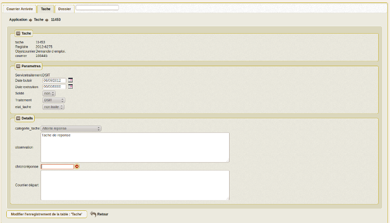

.. _tache:

################
Saisir une tache
################

Cet onglet permet de saisir les tâches associées aux courriers. 

Il est proposé de décrire dans ce paragraphe la saisie d'une tache associé à un courrier arrivée.

.. image:: tab_tache.png

Il est possible de creer ou modifier un courrier dans le formulaire ci dessous

Il est saisie :

- la date butoir (automatique en fonction de delai_reponse à la creation du courrier si autocreation_tache = true)

- la date exécution

- la catégorie de tache

- le Solde : Oui si soldée, Non sinon.  (voir traitement : courrier -> taches non soldées)

- le Service de traitement de la tache (les services "fils" ou sous service)

- L' état de la tâche, de type liste déroulante, renseigne sur l’état d’avancement du projet de réponse

- observations : Texte libre

- Chrono Éventuellement Texte libre ou courrier lié  (choix dans chronoreponse (fleche))

Parametres de tâche
===================

Paramétrage dans om_parametre de la collectivité ::

  	delai_reponse 	            15 	
  	autocreation_tache 	        true