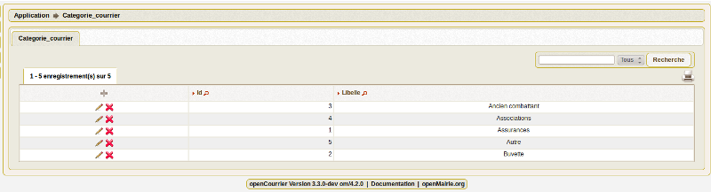
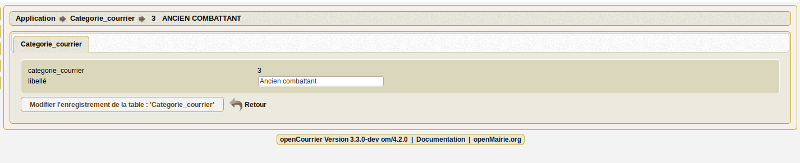

.. _categorie_courrier:

#############################
Saisir une catégorie courrier
#############################

Il est proposé de décrire dans ce paragraphe de decrire la saisie
d'une catégorie de courrier dans l'option paramétrage du menu 

Les categories sont listées dans le menu paramétrage

Il est possible de creer ou modifier une categorie dans le formulaire ci dessous

Il est saisie :

- le libelle de la catégorie

L'affichage de la catégorie est paramétrable dans om_parametre

Paramétrage de la collectivité ::
	
  	categorie_courrier 	        true ou false
