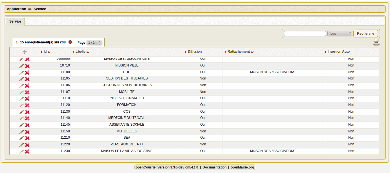

.. _service:

##################
Saisir un service
##################

Il est proposé de décrire dans ce paragraphe de decrire la saisie
d'un service dans l'option paramétrage du menu 

Les services sont listées dans l'option service du menu paramétrage

Il est possible de creer ou modifier une voie dans le formulaire ci dessous

.. image:: ../_static/form_service.png

Il est saisie :

- code

- libelle

- diffusion oui/non (reçoit ou non du courrier en traitement)

- service père (lien hiérarchique)

- insertion automatique

Règles
======

- seul un service "pére" peut attribuer des tâches à un service "fils"

- pour qu'un service "père" puisse visualiser les courrier de sous service (ou service "fils") mettre vue_sous_service=true dans om_parametre

Paramètrage service :
=====================

Dans om_parametre de la collectivité ::

    $vue_sous_service=true / false  (vue ou non des courriers des services "fils" par un service "père")