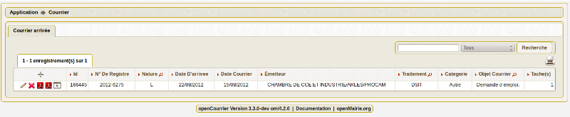
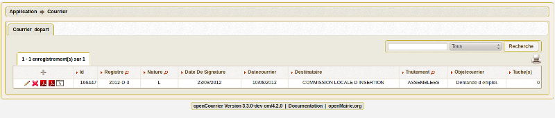
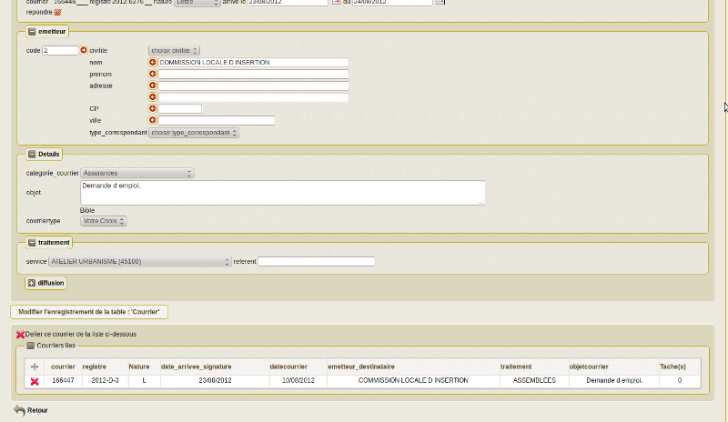
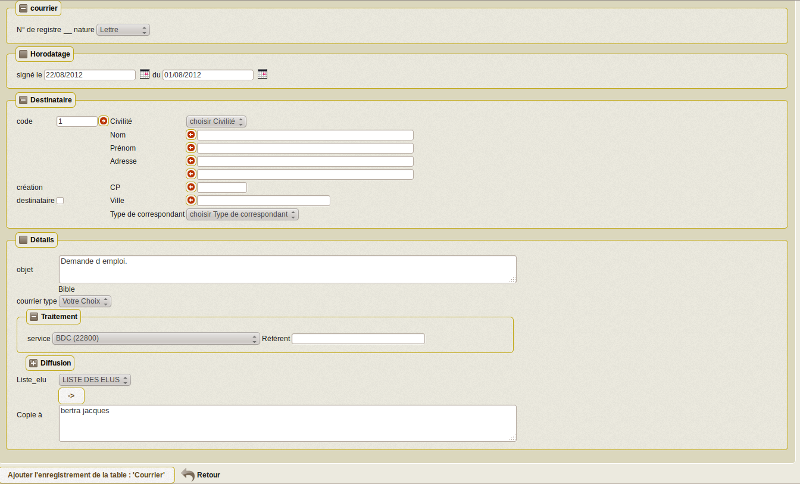
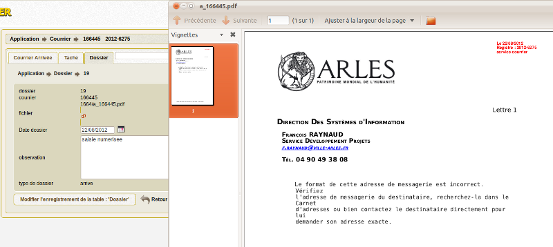

.. _courrier:

##################
Saisir un courrier
##################

Il est proposé de décrire dans ce paragraphe de decrire la saisie de courrier.

Les courriers sont saisis en "courrier_arrivée" ou "courrier_départ"

Le courrier "accusé de reception" est paramétré dans om_etat

Il est possible de creer ou modifier un courrier dans le formulaire ci dessous

Pour un courrier arrivée

Pour un courrier départ

Il est saisie dans courrier arrivée:
 
- le premier courrier scanné du répertoire utilisateur (si un SCAN existe) à associer s'affiche 

- la nature : lettre mail ... (paramétrable en var.inc par l administrateur)

- la date arrivée (date du jour par défaut) et date du courrier [obligatoire]
(Vous pouver utilisez le calendrier pour  la date   ou tapez  10122001 )       

- l'émetteur : nom, prénom, adresse, CP, Ville, type de correspondant. Il est possible de chercher un émetteur actif dans la table émetteur
en appuyant sur la flèche et de sauvegarder un émetteur en cochant la case (en ajout suelement).
Si un emetteur est choisi, l ensemble des données de l'emetteur est rapatrié dans la table courrier  

- la catégorie de courrier (si elle est paramétrée dans om_parametre)

- l'Objet : possibilité d'utiliser des textes paramétrés en appuyant sur le lien « bible »

- le Type de dossier : par défaut signalé ou non (paramétrable en var.inc par l administrateur)

- le traitement : service chargé du traitement : obligatoire et eventuellement le référent

- la diffusion : service(s) ayant une copie  (facultatif)

- copie à : copie à destination des élus (facultatif)

les pièces jointes : ce champ est supprimé dans la version 3.2.0

Il est saisie dans courrier départ :

- la nature : lettre mail ... (paramétrable en var.inc par l administrateur)

- la date signature (date du jour par défaut) et la date de départ 

- le destinataire : nom, prénom, adresse, CP, Ville, type de correspondant. Il est possible de chercher un destinataire actif dans la table émetteur
en appuyant sur la flèche et de sauvegarder un émetteur en cochant la case (en ajout suelement).
Si un emetteur est choisi, l ensemble des données de l'emetteur est rapatrié dans la table courrier  

- l'Objet : possibilité d'utiliser des textes paramétrés en appuyant sur le lien « bible »

- leType de dossier : par défaut signalé ou non (paramétrable en var.inc par l administrateur)

- le traitement : service chargé du traitement : obligatoire et eventuellement le référent

- la copieà : elu(s) ayant une copie  (facultatif)

Règles
======

Il est à noter que si un courrier scanné est associé lors de l'ajout du d'un courrier,
il est rajouté un enregistrement dans dossier avec sur le scan en rouge le numéro de registre et sa date d'arrivée.

Il est consiller de rajouter un utilisateur spécifique pour le scan.

Si le service est paramétré en "auto_insertion", il est automatiquement inséré dans diffusion (copie au directeur général par exemple)

Si l'élu est paramétré en "auto_insertion", il est automatiquement inséré dans copiea (copie au maire par exemple)

Voir paramétrage elu et service

Si autocreation_tache d'om_paramétre est à true, alors une tache sera automatiquement affectée au service de traitement avec 
un délai paramétré en nombre de jour dans l'om_parametre : delai_reponse

Paramètres de courrier
======================

paramètres de dyn/var.inc ::

    // nature dans objet courrier =============================================
    $select_nature=array('','CH','F','L','LAR','MAIL','TEL','TLE');
    $select_naturelib=array('Votre choix',
                'Chronopost',
                'Fax',
                'Lettre',
                'Lettre A/R',
                'Email',
                'T&eacute;l&eacute;copie',
                'T&eacute;l&eacute;gramme');
    // type dans objet courrier
    $select_type=array('', 's');
    $select_typelib=array('Votre Choix', 'signale');

Paramétrage de la collectivité ::

    registre_arrivee 	        [annee]-[seq] 	ARLES
    registre_depart 	        [annee]-D-[seq] 	
 	option_courrier_depart 	    true 	
  	categorie_courrier 	        true 	
  	autocreation_tache 	        true
