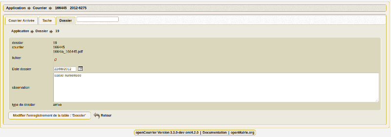

.. _dossier:

##################
Upload de document
##################

Le dossier sert à conserver l'ensemble des documents relatifs au courrier :

- le courrier arrivé scanné (voir paragraphe saisir le courrier)

- les courriers départs (au format PDF)

- les divers rapports d'intervention

- les pièces jointes ...

Il est proposé de décrire dans ce paragraphe l'upload de document dans les dossiers
dans l'onglet "dossier" d'un courrier départ ou arrivée.

Les documents du dossier  sont listés dans l'onglet "dossier"

.. image:: ../_static/tab_dossier.png

Il est possible de creer ou modifier un dossier dans le formulaire ci dessous

Les zones à saisir sont les suivantes :

- le fichier à associer  depuis son  poste de travail

    Le fichier est stocké dans le répertoire trs par centaine
    
    exemple : pour le courrier 1051; le fichier est stocké sous le nom 10/a_1051.pdf si courrier arrive
    et d_1051.pdf si courrier départ et éventuellement d_1051_2.pdf si un deuxième courrier départ est implémenté...  

- la date

- l'observation : champ texte

- le type : départ ou arrivé

AVERTISSEMENT
=============

Il est impératif de sauvegarder le répertoire trs/ où sont stockés les documents.

Il faut donc conserver ce répertoire en cas de changement de version

Il faut donner à apache les droits d'écriture sur ce répertoire (www-data) 
