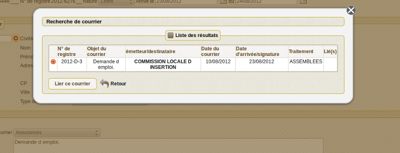

.. _liaison_courrier:

######################
La liaison de courrier
######################

Il est proposé de décrire dans ce paragraphe de decrire la liaison de courrier.

La liaison des courriers se fait en 3 étapes :

- dans le formulaire courrier_depart ou courrier_arrivee, appuyer sur le plus (ajout de courrier lié)

- le moteur de recherche de courrier apparait, saisir votre recherche et valider

.. image:: ../_static/liaison_recherche.png

- une liste de courrier correspondant à la recherche apparait, valider le courrier

- le courrier correspondant est lié

.. image:: ../_static/liaison_courrier.png

La liaison s'établit par un numéro commun aux courriers liés qui font chacun référence aux autres...