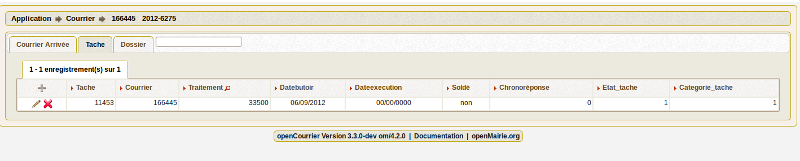

.. _tache:

################
Saisir une tache
################

cet onglet permet de saisir les tâches associés aux courriers. 

Il est proposé de décrire dans ce paragraphe la saisie d'une tache associé à un courrier arrivée.

Il est possible de creer ou modifier un courrier dans le formulaire ci dessous

.. image:: ../_static/form_tache.png

Il est saisie :

- la Date butoir (automatique en fonction de delai_reponse à la creation du courrier si autocreation_tache = true)

- la Date exécution

- la catégorie de tache

- le Solde : Oui si soldée, Non sinon 
Tant que c'est non soldé, la tache apparaît dans l'option:
courrier -> taches non soldées

- le Service de traitement de la tache (les services "fils" ou sous service)

- L' état de la tâche, de type liste déroulante, renseigne sur l’état d’avancement du
projet de réponse entrepris par le service destinataire de la requête du citoyen.

- observations : Texte libre

- Chrono Éventuellement Texte libre ou registre objet du chrono départ

Paramétrage de la collectivité ::

  	delai_reponse 	            15 	
  	autocreation_tache 	        true